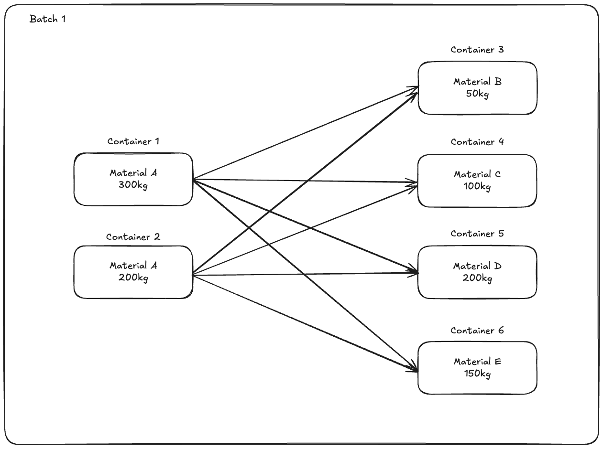
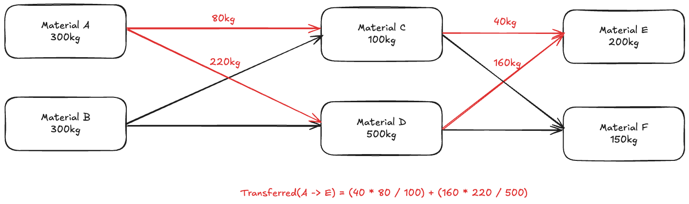

# Gaea - Software Engineering Interview Task

Welcome to the Gaea Software Engineering Interview Task! This take-home assignment is designed to assess your technical skills, problem-solving abilities, and coding practices. We're not just assessing the correctness of your solution, we're also interested in your code style and how you structure the problem.

We appreciate your time and effort in completing this task and expect the task to take no longer then 2 hours. If you have any questions or clarifications don't hesitate to contact us.

## Task Overview

In this assignment, you will be working on a project that aligns with Gaea's mission and technology stack. Gaea's core functionality tracks the recycling process for end of life materials such as batteries, electronic waste and other recyclable materials.

When a material is recycled it often goes through a multi-stage process. Each of these processes result in multiple new materials resulting from the first. For example, you may sort through a drum of mixed household batteries (AA, AAA, 9V etc) and sort them into brands (Duracell, Energizer, etc). The resulting weight of each of material is what Gaea tracks, we call these material transfers.

This allows recyclers to track material from the start of the process to the end, meaning they can work out for example How much of my duracell batteries came from a specific supplier. These processes can also happen in batches (more than one input), this means we have to average the output weights over the inputs, this is called a mass balance, this results in less accurate transfers, but is often easier and faster to implement in a recycling facility.



In this task you will be using these material transfers to answer similar questions that our customers have, and are most important to them.

## Instructions

1. Clone this repository to your local machine.
2. Create a private repository in your personal github account
3. Remove the original remote from the cloned repository `git remote remove origin`
4. Add your personal repo as a remote `git remote add origin git@github.com/<personal-account>/<repo>`
5. Push main to your personal repository `git push --set-upstream origin main`

Please ensure all of your work is committed to the main branch and pushed to your personal repository, as this is the only work we'll consider.

Please complete all of the following tasks. You may use any programming language, provided all of the code used can be committed to this repository. You don't need to provide instructions for running the code, or any explanation other than the answers. We're looking to assess how you write and structure code, so please don't just use SQL.

### Task 1

In this repository, you'll find a csv file `transfers.csv`. This file contains a sample of material transfer that we set out in the overview section. The structure is as follows:

| Column        | Type     | Description                                                               |
| ------------- | -------- | ------------------------------------------------------------------------- |
| organization  | UUID     | Organization the material transfer belongs to                             |
| from_material | UUID     | Material the transfer originated from                                     |
| to_material   | UUID     | Material transferred to                                                   |
| weight        | Integer  | Total amount in kilograms transfers from `from_material` to `to_material` |
| date          | DateTime | When the transfer ocurred                                                 |

Your first task is to take this csv and find the organization that processed the most material on 7th August 2024 and how much material in kilograms they processed on this date. Your answer should state the UUID of the organization and the total amount of kilograms processed.

**Answer:**

### Task 2

A material transfer is said to be the same as another if they are from the same material and to the same material. What was the most common transfer from one material to another and how many transfers of this type were there?

**Answer:**

### Task 3

During a multi step process where material A is processed to materials (X, Y, Z, ...) and then these materials (X, Y, Z, ...) are processed to material B. We can approximate how much of material A is in material B by using a mass balance:

```tex
Transfers A -> B = SUM(SUM(Transfers A -> N) / SUM(Transfers -> N) * SUM(Transfers N -> B))
```

Where N are the intermidiate material X, Y, Z, ...etc.



With this in mind calculate how much of material `4d876d21-f841-4461-9122-799331c39527` ended up in material `d2523f75-6e98-4654-a261-61e3f09e1eb8` across all organizations.

**Answer:**

## Submission

Once you've completed the task, make sure:

1. You've committed all of the code used, and your edited answers, to the main branch.
2. You've pushed all of the changes to your personal repository.
3. You've invited `@jwalton9` as a collaborator to your personal repository.
4. You've sent a link to your repository, in an email or message to us.

Good luck!
